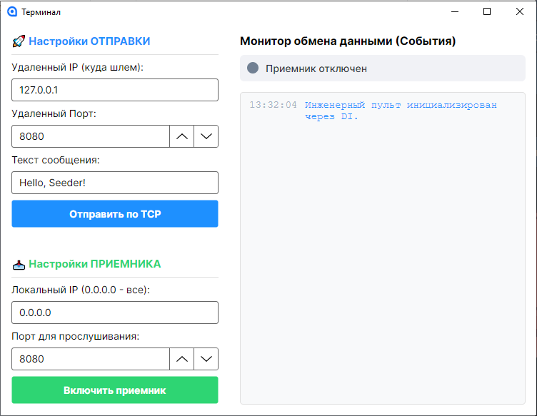

# Тестовое задание: Сетевой TCP/JSON терминал

Программа для отправки и получения командных пакетов в формате JSON по протоколу TCP/IP и мониторинга ответов. Разработано на базе **Avalonia UI** (MVVM) и **.NET 9**.

## 🛠️ Стек технологий:
* **C# 13 / .NET 9**
* **Avalonia UI 11+** (XAML)
* **ReactiveUI**
* **System.Text.Json** (Сериализация пакетов DTO)

